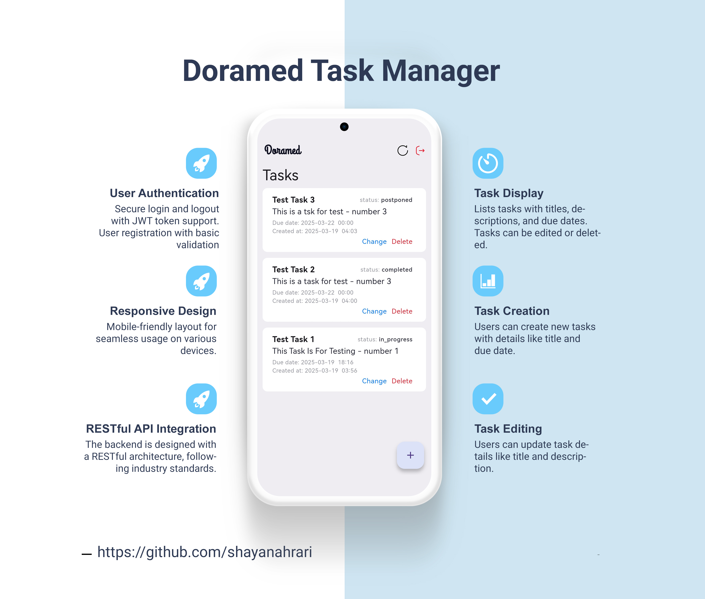
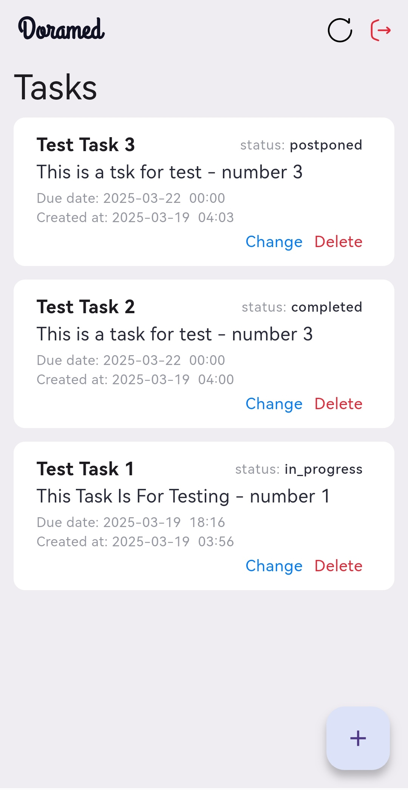
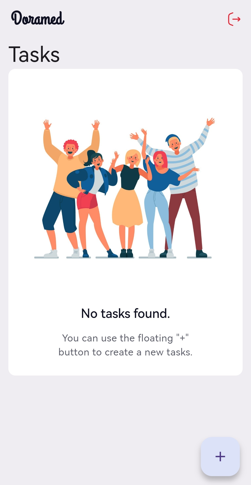
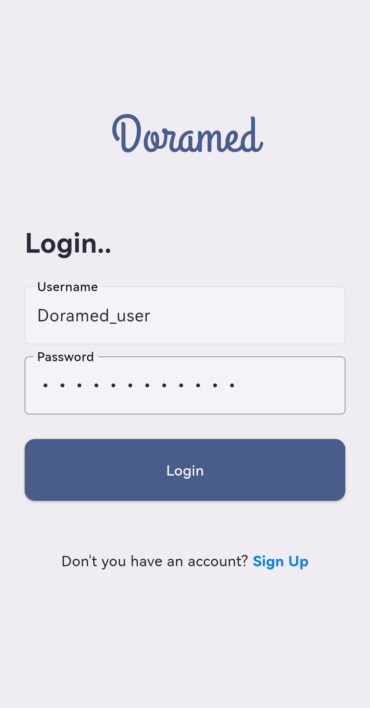
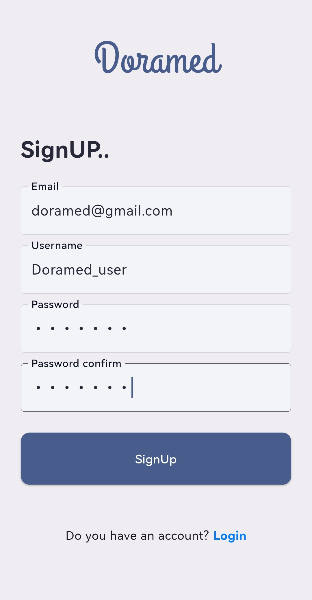
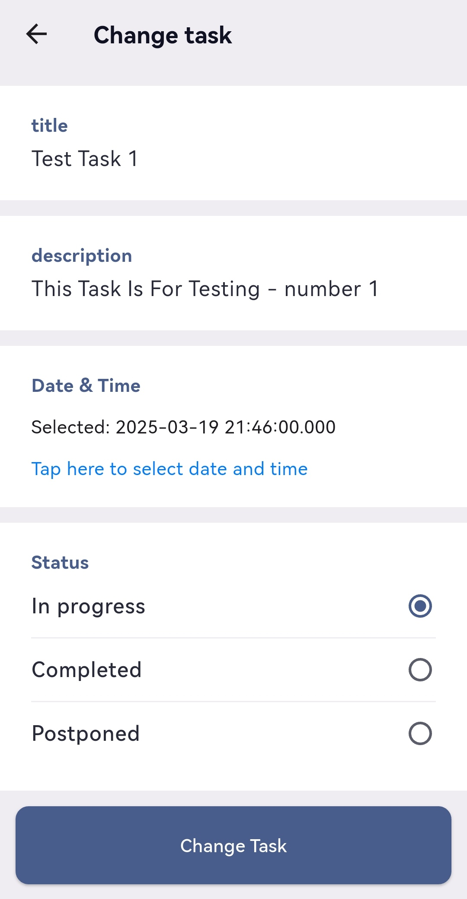
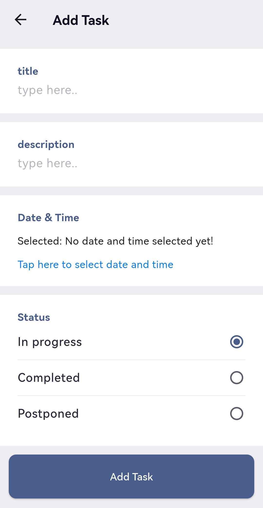
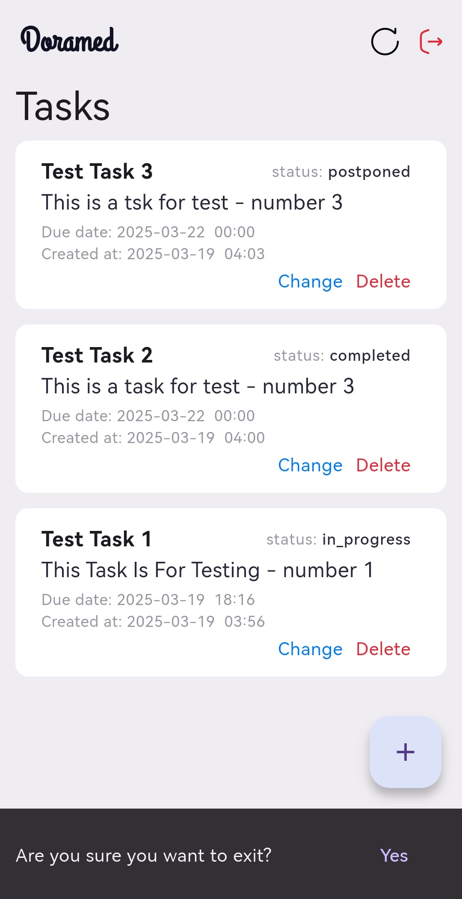
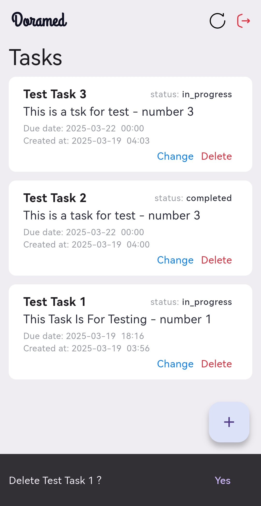

# Flutter Project - Doramed Task Manager

This is a simple Flutter application for managing the daily tasks

## Introduction Image



## Prerequisites

Before you begin, ensure you have the following installed on your machine:

- [Flutter SDK](https://flutter.dev/docs/get-started/install)
- [Dart SDK](https://dart.dev/get-dart)
- [Android Studio](https://developer.android.com/studio) or [Visual Studio Code](https://code.visualstudio.com/) with Flutter and Dart plugins installed.

## Getting Started

To get started with this Flutter project:

1. Clone this repository:

   ```bash
   git clone https://github.com/shayanahrari/doramed_task_frontend.git
   ```

2. Navigate to the project directory:

   ```bash
   cd your-flutter-project
   ```

3. Install the dependencies:

   ```bash
   flutter pub get
   ```

4. Run the project:

   ```bash
   flutter run
   ```

## Screeshots

<div style="display: flex; justify-content: space-around;">
  
  
  
</div>

<div style="display: flex; justify-content: space-around;">
  
  
  
</div>

<div style="display: flex; justify-content: space-around;">
  
  
</div>


